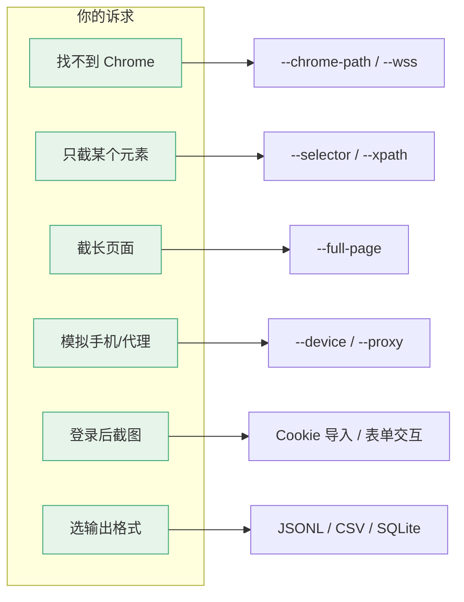

# 常见问题 FAQ

<p align="center">❓ 使用 snir 时的常见疑问解答。</p>

按诉求快速定位能力：



## 安装与运行

### 截图需要 Chrome 吗？

需要本地 Chrome/Chromium，**或**指向远程 CDP 端点 `--wss ws://host:9222/devtools/browser/<id>`。见 [远程 Chrome](../advanced/remote-chrome)。

### 找不到 Chrome 怎么办？

```bash
snir scan example.com --chrome-path /usr/bin/chromium
```

或让 chromedp 自动发现，或用远程 Chrome。

### 支持 Windows 吗？

二进制主要面向 Linux/macOS/BSD。Windows 可从源码构建，但需自行解决 Chrome 路径问题。

## 功能

### `--ports` 是端口扫描吗？

不是。`--ports` 把裸 host/IP 展开成 Web 候选 URL（如 `host:8080` → `http://host:8080`、`https://host:8080`），是 Web 端点展开，不是 TCP/UDP 探测。

### 如何只截某个元素？

```bash
snir scan example.com --selector "#main"
# 或 XPath
snir scan example.com --xpath "//div[@id='main']"
```

### 如何截完整长页面？

```bash
snir scan example.com --full-page
```

### 如何模拟手机？

```bash
snir scan example.com --device iphone-15
snir scan --list-devices  # 查看全部预设
```

### 如何用代理？

```bash
snir scan example.com --proxy http://127.0.0.1:8080
# 或轮换
snir scan file -f urls.txt --proxy-list http://p1:8080 --proxy-list http://p2:8080 --proxy-strategy round-robin
```

见 [代理](../advanced/proxy)。

### 如何登录后再截图？

用 Cookie 导入或表单交互。见 [Cookie 管理](../advanced/cookie) 与 [表单与交互](../advanced/forms)。

## 输出

### JSONL、CSV、SQLite 选哪个？

- **JSONL**：流式追加，适合管线与下游脚本
- **CSV**：表格化，适合 Excel
- **SQLite**：结构化查询，建索引，适合长期存储与分析

可同时启用多个 Writer。

### 截图保存在哪？

默认 `./screenshots/`，用 `--screenshot-path` 修改。文件名由 `SanitizeFilename` 清理非法字符。

## 性能

### 并发多少合适？

取决于机器与目标。`--threads` 控制并发；太多会触发目标限流或耗尽内存。建议从 5-10 起步。见 [性能调优](../advanced/performance)。

### 如何复用浏览器？

用共享池（SDK `Shared*` 函数）或 `snir provider` 跨进程共享。见 [并发与池](../advanced/concurrency)。

## 安全

### 可以扫描任意网站吗？

须在授权范围内扫描第三方资产。默认黑名单屏蔽内网与元数据地址以防 SSRF。见 [安全注意](../advanced/security)。

## 下一步

- [故障排查](../advanced/troubleshooting)
- [更新日志](./changelog)
- [CLI 标志全表](./cli-flags)
