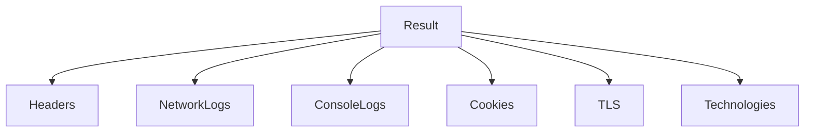
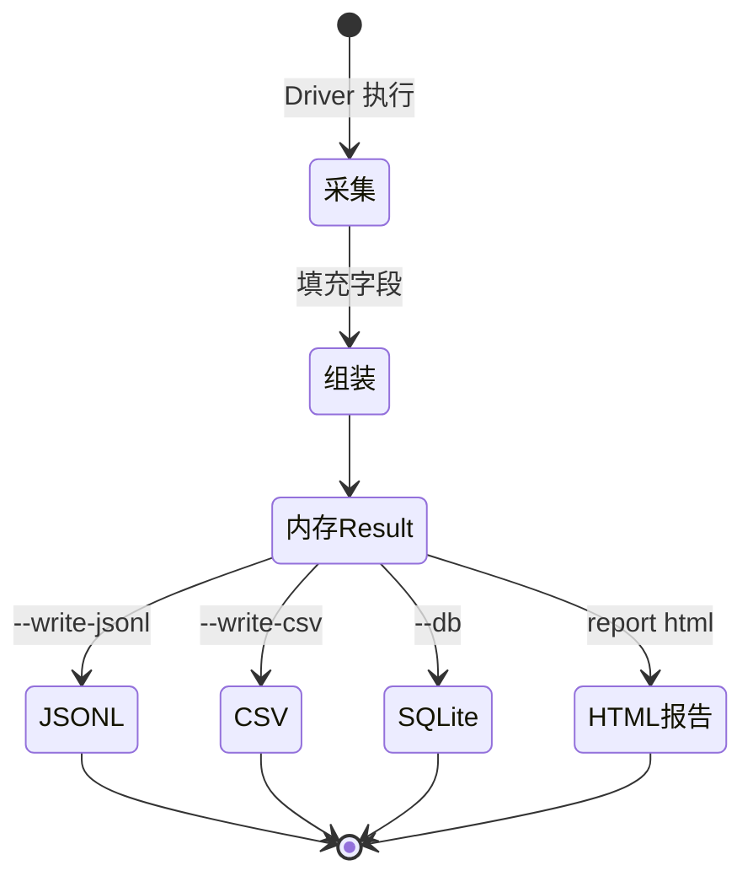

# 字段字典

📖 Result 子结构字段详解。

> 📁 源码：[`pkg/models/models.go`](https://github.com/cyberspacesec/snir-skills/blob/main/pkg/models/models.go)

## Header

[`Header`](https://github.com/cyberspacesec/snir-skills/blob/main/pkg/models/models.go#L145) — HTTP 响应头。

| 字段 | 说明 |
|------|------|
| `Name` | 头名 |
| `Value` | 头值 |

## NetworkLog

[`NetworkLog`](https://github.com/cyberspacesec/snir-skills/blob/main/pkg/models/models.go#L153) — 网络请求记录（HAR 风格）。

| 字段 | 说明 |
|------|------|
| `Method` | HTTP 方法 |
| `URL` | 请求 URL |
| `Status` | 响应码 |
| `Type` | 资源类型（XHR/Doc/Script…） |
| `Size` | 字节数 |
| `Time` | 耗时 |
| `Initiator` | 发起方 |

## ConsoleLog

[`ConsoleLog`](https://github.com/cyberspacesec/snir-skills/blob/main/pkg/models/models.go#L165) — 浏览器 Console 输出。

| 字段 | 说明 |
|------|------|
| `Type` | log/warn/error/info |
| `Text` | 内容 |
| `URL` | 来源 URL |
| `Line` | 行号 |
| `Stack` | 调用栈 |

## Cookie

[`Cookie`](https://github.com/cyberspacesec/snir-skills/blob/main/pkg/models/models.go#L173) — 采集到的 Cookie。

| 字段 | 说明 |
|------|------|
| `Name/Value` | 键值 |
| `Domain/Path` | 作用域 |
| `Expires` | 过期 |
| `Secure/HttpOnly/SameSite` | 属性 |
| `Source` | 来源 |

## TLS

[`TLS`](https://github.com/cyberspacesec/snir-skills/blob/main/pkg/models/models.go#L183) — 证书信息。

| 字段 | 说明 |
|------|------|
| `Version` | TLS 版本 |
| `CipherSuite` | 加密套件 |
| `Subject` | 主体 |
| `Issuer` | 签发者 |
| `NotBefore/NotAfter` | 有效期 |
| `SANs` | 备用名 |

## Technology

[`Technology`](https://github.com/cyberspacesec/snir-skills/blob/main/pkg/models/models.go#L197) — 检测到的技术。

| 字段 | 说明 |
|------|------|
| `Name` | 技术名 |
| `Category` | 分类 |
| `Version` | 版本 |
| `Confidence` | 置信度 |
| `Matches` | 命中指纹 |

## 关系图

一条 Result 从采集到多形态输出的状态流转：

## 下一步

- [Result Schema](./result-schema)
- [pkg/models（内部）](../internals/models)
- [证据（进阶）](../advanced/evidence)
- [技术检测](../internals/techdetect)
