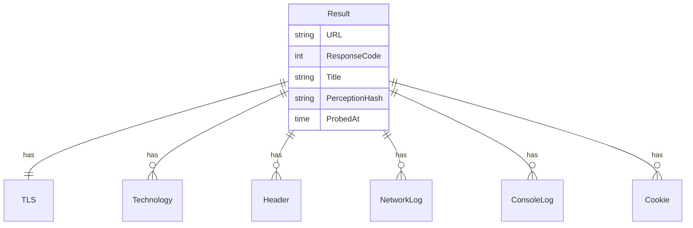
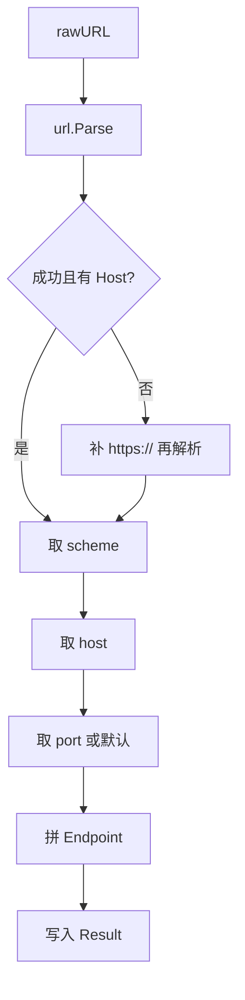

# Result Schema

📋 `pkg/models/models.go` — 采集结果数据契约。

`Result` 是 snir 一切采集的顶层结构，序列化为 JSONL/CSV、持久化到 SQLite、喂给报告生成。

> 📁 源码：[`pkg/models/models.go`](https://github.com/cyberspacesec/snir-skills/blob/main/pkg/models/models.go)

## 顶层结构

| 符号 | 源码 | 说明 |
|------|------|------|
| `RequestType` | [L14](https://github.com/cyberspacesec/snir-skills/blob/main/pkg/models/models.go#L14) | 请求类型枚举 |
| `Result` | [L22](https://github.com/cyberspacesec/snir-skills/blob/main/pkg/models/models.go#L22) | 顶层结果 |
| `EnrichEndpoint` | [L117](https://github.com/cyberspacesec/snir-skills/blob/main/pkg/models/models.go#L117) | 端点归一化 |
| `DefaultPortForScheme` | [L124](https://github.com/cyberspacesec/snir-skills/blob/main/pkg/models/models.go#L124) | 协议默认端口 |

## Result 字段一览

| 字段 | 行 | 类型 | 说明 |
|------|----|------|------|
| `Path` | [L23](https://github.com/cyberspacesec/snir-skills/blob/main/pkg/models/models.go#L23) | string | 截图存储路径 |
| `ID` | [L24](https://github.com/cyberspacesec/snir-skills/blob/main/pkg/models/models.go#L24) | uint | 主键 |
| `URL` | [L26](https://github.com/cyberspacesec/snir-skills/blob/main/pkg/models/models.go#L26) | string | 原始目标 |
| `SchemaVersion` | [L27](https://github.com/cyberspacesec/snir-skills/blob/main/pkg/models/models.go#L27) | string | schema 版本 |
| `Scheme/Host/Port/Endpoint` | [L28-31](https://github.com/cyberspacesec/snir-skills/blob/main/pkg/models/models.go#L28) | | 归一化端点 |
| `ProbedAt` | [L32](https://github.com/cyberspacesec/snir-skills/blob/main/pkg/models/models.go#L32) | time | 采集时间 |
| `FinalURL` | [L33](https://github.com/cyberspacesec/snir-skills/blob/main/pkg/models/models.go#L33) | string | 跳转后 URL |
| `ResponseCode/Reason` | [L34-35](https://github.com/cyberspacesec/snir-skills/blob/main/pkg/models/models.go#L34) | | 状态码/原因 |
| `Protocol` | [L36](https://github.com/cyberspacesec/snir-skills/blob/main/pkg/models/models.go#L36) | string | HTTP 协议版本 |
| `ContentLength` | [L37](https://github.com/cyberspacesec/snir-skills/blob/main/pkg/models/models.go#L37) | int64 | 内容长度 |
| `HTML` | [L38](https://github.com/cyberspacesec/snir-skills/blob/main/pkg/models/models.go#L38) | string | 页面 HTML |
| `Title` | [L39](https://github.com/cyberspacesec/snir-skills/blob/main/pkg/models/models.go#L39) | string | 标题 |
| `PerceptionHash` | [L40](https://github.com/cyberspacesec/snir-skills/blob/main/pkg/models/models.go#L40) | string | pHash |
| `PerceptionHashGroupId` | [L41](https://github.com/cyberspacesec/snir-skills/blob/main/pkg/models/models.go#L41) | uint | pHash 分组 |
| `Screenshot` | [L42](https://github.com/cyberspacesec/snir-skills/blob/main/pkg/models/models.go#L42) | string | 截图路径/引用 |
| `ScreenshotBytes` | [L43](https://github.com/cyberspacesec/snir-skills/blob/main/pkg/models/models.go#L43) | []byte | 截图字节（不持久化） |
| `Filename` | [L46](https://github.com/cyberspacesec/snir-skills/blob/main/pkg/models/models.go#L46) | string | 文件名 |
| `IsPDF` | [L47](https://github.com/cyberspacesec/snir-skills/blob/main/pkg/models/models.go#L47) | bool | 是否 PDF |
| `Failed/FailedReason` | [L50-51](https://github.com/cyberspacesec/snir-skills/blob/main/pkg/models/models.go#L50) | | 失败标记 |

## 关联（一对多）

| 字段 | 行 | 类型 | 说明 |
|------|----|------|------|
| `TLS` | [L53](https://github.com/cyberspacesec/snir-skills/blob/main/pkg/models/models.go#L53) | TLS | 证书信息 |
| `Technologies` | [L54](https://github.com/cyberspacesec/snir-skills/blob/main/pkg/models/models.go#L54) | []Technology | 技术栈 |
| `Headers` | [L56](https://github.com/cyberspacesec/snir-skills/blob/main/pkg/models/models.go#L56) | []Header | 响应头 |
| `Network` | [L57](https://github.com/cyberspacesec/snir-skills/blob/main/pkg/models/models.go#L57) | []NetworkLog | 网络日志 |
| `Console` | [L58](https://github.com/cyberspacesec/snir-skills/blob/main/pkg/models/models.go#L58) | []ConsoleLog | Console 日志 |
| `Cookies` | [L59](https://github.com/cyberspacesec/snir-skills/blob/main/pkg/models/models.go#L59) | []Cookie | Cookies |

## ER 图

## EnrichEndpoint 流程

[`EnrichEndpoint`](https://github.com/cyberspacesec/snir-skills/blob/main/pkg/models/models.go#L117) 把原始 `URL` 拆解为 `Scheme/Host/Port/Endpoint`：

## 序列化约定

- `ScreenshotBytes` 标 `json:"-"` 不进 JSON，避免大块 base64
- GORM 索引：`html/title/perception_hash` 便于查询
- 关联 `OnDelete:CASCADE`：删 Result 连带删子记录

## 子结构

详见 [字段字典](./fields)。

## 下一步

- [字段字典](./fields)
- [pkg/models（内部）](../internals/models)
- [结果与证据（SDK）](../sdk/result)
- [输出格式](../advanced/output-formats)
