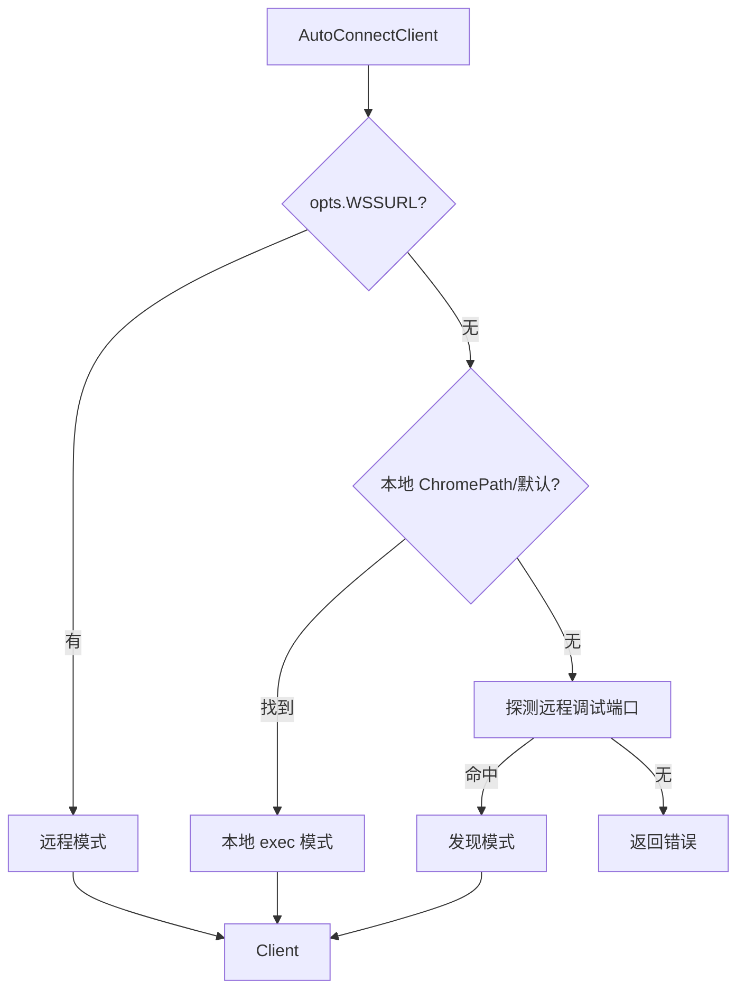

# 自动连接

<p align="center">🤝 `pkg/sdk/autoconnect.go` — 自动发现并连接 Chrome。</p>

按优先级探测可用 Chrome（本地路径→远程调试端口），无需手动配置即建 Client。

> 📁 源码：[`pkg/sdk/autoconnect.go`](https://github.com/cyberspacesec/snir-skills/blob/main/pkg/sdk/autoconnect.go)

## 类型

| 符号 | 源码 | 说明 |
|------|------|------|
| `AutoConnectMode` | [L15](https://github.com/cyberspacesec/snir-skills/blob/main/pkg/sdk/autoconnect.go#L15) | 连接模式枚举 |
| `AutoConnectClient(opts)` | [L36](https://github.com/cyberspacesec/snir-skills/blob/main/pkg/sdk/autoconnect.go#L36) | 自动连接并建 Client |

## 探测优先级



::: tip 零配置也能跑，按优先级自动找 Chrome
`AutoConnectClient` 不强制配置——按以下优先级探测可用 Chrome：`opts.WSSURL` 指定则远程 WSS 模式；本地 `ChromePath` 或默认路径能找到则本地 exec 模式；探测已运行的远程调试端口（如 `:9222`）则发现模式；都没有返回错误。

返回的 `AutoConnectMode` 告诉你实际用了哪种，便于日志排查。
:::

## AutoConnectMode 取值

| 模式 | 说明 |
|------|------|
| 本地 exec | 启动本地 Chrome 进程 |
| 远程 WSS | 连指定 WebSocket |
| 发现 | 探测到已运行的远程调试端口 |

返回值带 `AutoConnectMode`，便于日志/调试知道用了哪种。

## 与 discovery 的关系

[`AutoConnectClient`](https://github.com/cyberspacesec/snir-skills/blob/main/pkg/sdk/autoconnect.go#L36) 复用 [`pkg/runner/discovery`](../internals/runner-discovery) 的 `DiscoverChrome`/`AutoConnect`。

## 示例

```go
client, mode, err := sdk.AutoConnectClient(sdk.DefaultClientOptions())
if err != nil { log.Fatal(err) }
defer client.Close()
log.Printf("已连接，模式: %s", mode)
```

## 下一步

- [Client](./client)
- [Discovery（内部）](../internals/runner-discovery)
- [远程 Chrome](../advanced/remote-chrome)
- [CLI scan chrome](../cli/scan-chrome)
