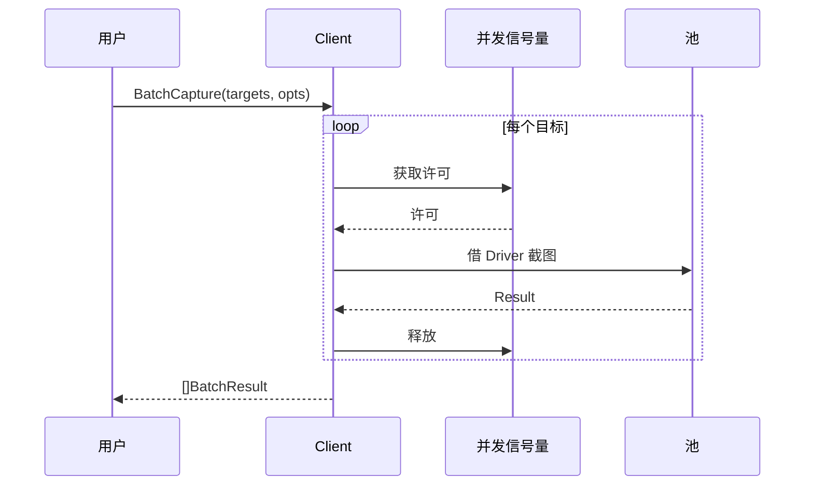

# 批量采集

<p align="center">🗂️ 并发采集多个目标。</p>

`Client` 提供 `BatchCapture*` 系列方法，并发处理目标列表，返回 `BatchResult`。

> 📁 源码：[`pkg/sdk/client.go`](https://github.com/cyberspacesec/snir-skills/blob/main/pkg/sdk/client.go)

## 类型

| 符号 | 源码 | 说明 |
|------|------|------|
| `BatchResult` | [L1656](https://github.com/cyberspacesec/snir-skills/blob/main/pkg/sdk/client.go#L1656) | 批量结果（含 Result） |
| `BatchBytesResult` | [L1664](https://github.com/cyberspacesec/snir-skills/blob/main/pkg/sdk/client.go#L1664) | 含截图字节 |
| `BatchEvidenceBundleResult` | [L1673](https://github.com/cyberspacesec/snir-skills/blob/main/pkg/sdk/client.go#L1673) | 含完整证据包 |
| `ScreenshotRequest` | [L1683](https://github.com/cyberspacesec/snir-skills/blob/main/pkg/sdk/client.go#L1683) | 单条请求 |
| `batchEvidenceBundleDir` | [L1702](https://github.com/cyberspacesec/snir-skills/blob/main/pkg/sdk/client.go#L1702) | 证据包目录命名 |

## 流程



## BatchResult 字段

| 字段 | 说明 |
|------|------|
| `Target` | 原始目标 |
| `Result` | `*models.Result` |
| `Error` | 错误（若有） |
| `Index` | 在批次中的序号 |

## 输入展开

::: info 混合输入一条命令搞定
配合 [`ExpandTargets`](./targets) 支持混合输入——单个 URL、CIDR 网段、目标文件可混着传，统一展开为候选列表：

```go
targets := sdk.ExpandTargets([]string{"example.com", "10.0.0.0/29", "list.txt"}, nil)
results, _ := client.BatchCapture(targets, sdk.WithFullPage())
for _, r := range results {
    if r.Error != nil {
        log.Printf("%s 失败: %v", r.Target, r.Error)
    }
}
```
`r.Index` 保持原始顺序，方便回溯是哪个输入扫挂了。
:::

## 变体

| 方法 | 返回 |
|------|------|
| `BatchCapture` | `[]BatchResult`（含 Result） |
| `BatchCaptureBytes` | `[]BatchBytesResult`（含 PNG） |
| `BatchCaptureEvidenceBundle` | `[]BatchEvidenceBundleResult`（含全证据） |

## 下一步

- [Client](./client)
- [目标展开](./targets)
- [Scan（内部）](../internals/scan)
- [并发与池](../advanced/concurrency)
