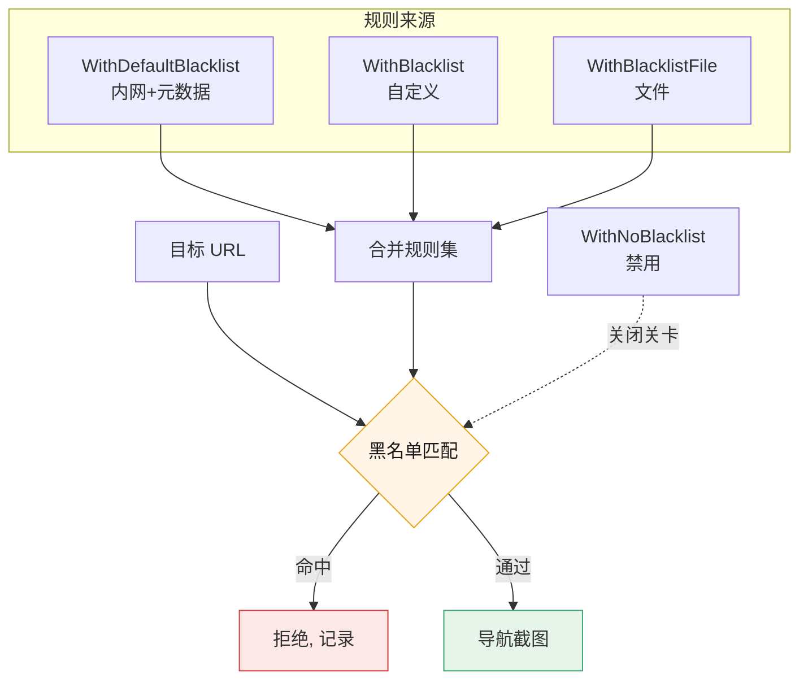

# 黑名单构建器

<p align="center">🚫 SDK 配置目标黑名单。</p>

## 选项

| 选项 | 说明 |
|------|------|
| `WithBlacklist(patterns...)` | 自定义规则 |
| `WithDefaultBlacklist()` | 启用内置默认规则 |
| `WithBlacklistFile(path)` | 规则文件 |
| `WithNoBlacklist()` | 禁用黑名单 |

## 示例

```go
// 默认 + 自定义
opts := sdk.NewScreenshotOptions(
    sdk.WithDefaultBlacklist(),
    sdk.WithBlacklist("internal.local", "10.0.0.0/8"),
)

// 规则文件
opts := sdk.NewScreenshotOptions(
    sdk.WithDefaultBlacklist(),
    sdk.WithBlacklistFile("blocklist.txt"),
)

// 禁用（仅受控内网）
opts := sdk.NewScreenshotOptions(
    sdk.WithNoBlacklist(),
)
```

## 规则语法

支持 CIDR（`10.0.0.0/8`）、正则（`.*:6379`）、字面量（`localhost`）。默认规则屏蔽内网与云元数据，见 [黑名单 CLI](../cli/scan-blacklist)。

URL 在进入浏览器前需通过黑名单关卡：



## 安全

::: danger SSRF 防护底线
- ✅ 生产环境**保留默认黑名单**（`WithDefaultBlacklist()`）防 SSRF
- ✅ 对外部输入的目标先过黑名单再采集
- ⚠️ 仅在**授权内网扫描**时才 `WithNoBlacklist()`
- ❌ SDK 接收外部 URL 的场景（如自建 API），黑名单更是必需——否则用户传个 `169.254.169.254` 就能打云元数据
:::

## 下一步

- [构建器总览](./builders)
- [黑名单（进阶）](../advanced/blacklist)
- [内部 pkg/runner/blacklist](../internals/runner-blacklist)
