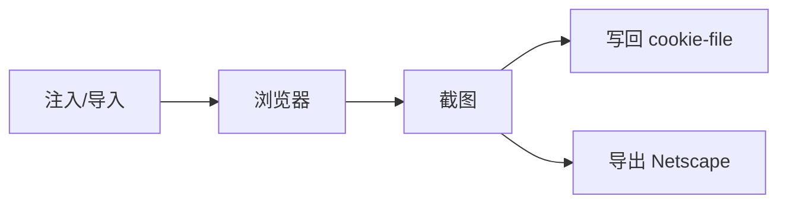

# Cookie 构建

<p align="center">🍪 SDK 注入与管理 Cookie。</p>

## 选项

| 选项 | 说明 |
|------|------|
| `WithInjectedCookies(cookies...)` | 注入 `CustomCookie` |
| `WithCookieHeader(header)` | `name=value; name2=value2` 格式 |
| `WithCookieStrings(headers...)` | 多个 `name=value` |
| `WithCookieImport(path)` | 导入 Netscape 文件 |
| `WithCookieExport(path)` | 导出 Netscape |
| `WithCookieFile(path)` | Cookie 持久化文件（JSON） |
| `WithCookieWriteBack()` | 截图后写回 |

## CustomCookie

`runner.CustomCookie` 是注入用的 Cookie 结构（含 name/value/domain/path 等）。

## 示例

```go
// 注入
opts := sdk.NewScreenshotOptions(
    sdk.WithInjectedCookies(
        runner.CustomCookie{Name: "session", Value: "abc123", Domain: "example.com"},
    ),
)

// Header 格式
opts := sdk.NewScreenshotOptions(
    sdk.WithCookieHeader("session=abc123; token=xyz"),
)

// 持久化 + 写回
opts := sdk.NewScreenshotOptions(
    sdk.WithCookieFile("cookies.json"),
    sdk.WithCookieWriteBack(),
)

// 导入 Netscape（curl 登录态）
opts := sdk.NewScreenshotOptions(
    sdk.WithCookieImport("login.txt"),
)
```

## 工作流



## 与证据采集区别

::: warning 注入 ≠ 采集，方向相反
| 类别 | 选项 | 方向 | 作用 |
|------|------|------|------|
| **注入** | `WithCookie*` / `WithCookieImport` | 外部 → 浏览器 | 设会话 Cookie 维持登录态 |
| **采集** | `WithCookies()` | 浏览器 → Result | 把浏览器 Cookie 存为证据 |

可同用：`WithCookieImport` 带登录态截图，再 `WithCookies()` 把实际 Cookie 采下来。
:::

详见 [Cookie 管理（进阶）](../advanced/cookie)。

## 下一步

- [构建器总览](./builders)
- [Cookie 管理（进阶）](../advanced/cookie)
- [CookieJar 内部](../internals/runner-cookie-jar)
