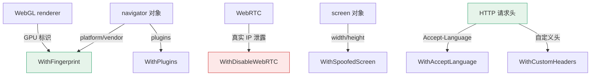

# 指纹构建

<p align="center">🎭 浏览器指纹伪装（反检测）。</p>

## 选项

| 选项 | 说明 |
|------|------|
| `WithFingerprint(platform, vendor, webGLVendor, webGLRenderer)` | 指纹基线 |
| `WithPlugins(plugins...)` | 浏览器插件列表 |
| `WithDisableWebRTC()` | 禁用 WebRTC（防真实 IP 泄露） |
| `WithSpoofedScreen(width, height)` | 欺骗屏幕尺寸 |
| `WithAcceptLanguage(language)` | Accept-Language 头 |
| `WithCustomHeaders(headers)` | 自定义 HTTP 头 |

## 示例

```go
opts := sdk.NewScreenshotOptions(
    sdk.WithFingerprint("Win32", "Google Inc.", "Intel Inc.", "Intel Iris"),
    sdk.WithPlugins("PDF Viewer", "Chrome PDF Viewer"),
    sdk.WithAcceptLanguage("zh-CN,zh;q=0.9"),
    sdk.WithDisableWebRTC(),
    sdk.WithSpoofedScreen(1920, 1080),
    sdk.WithCustomHeaders(map[string]string{"X-Custom": "value"}),
)
```

## 反检测要点

::: warning WebRTC 是指纹伪装的最大漏洞
其他指纹项（platform/WebGL/screen）伪装得再好，**WebRTC 一旦启用就会通过 STUN 直连暴露真实公网/内网 IP**——指纹伪装前功尽弃。

走代理采集时**务必** `WithDisableWebRTC()`，否则真实 IP 会被目标站点通过 WebRTC 探出。
:::

各选项对应的指纹暴露面：



- **platform/vendor**：`navigator.platform`、`navigator.vendor`
- **WebGL**：`WEBGL_debug_renderer_info` 暴露的 GPU 标识
- **WebRTC**：可能泄露真实 IP，建议禁用
- **屏幕**：`screen.width/height` 与视口解耦

## 客户端级 vs 单次级

指纹也可在 `ClientOptions` 设客户端基线，单次 `With*` 覆盖。见 [ClientOptions](./client-options)。

## 下一步

- [构建器总览](./builders)
- [浏览器指纹（进阶）](../advanced/fingerprint)
- [ClientOptions](./client-options)
