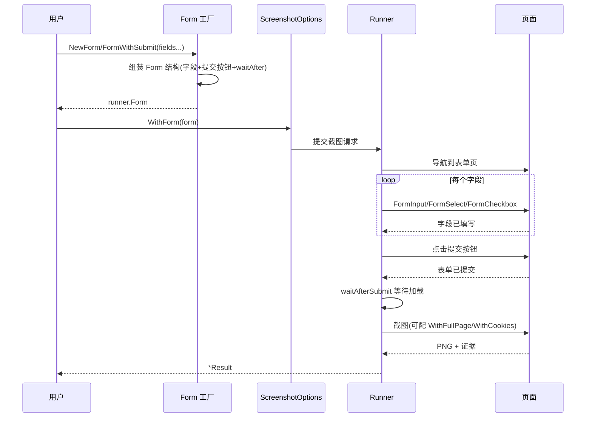

# 表单构建

<p align="center">📝 结构化表单填写与提交。</p>

## 选项

`WithForm(form)` 接收 `runner.Form`。

## Form 工厂

| 工厂 | 说明 |
|------|------|
| `NewForm(fields...)` | 基础表单 |
| `FormWithSubmit(submitSelector, waitAfter, fields...)` | 带提交按钮 |
| `FormWithSubmitXPath(submitXPath, waitAfter, fields...)` | 带提交（XPath） |

## 字段工厂

| 工厂 | 说明 |
|------|------|
| `FormInput(selector, value)` | 文本输入 |
| `FormInputXPath(xpath, value)` | 输入（XPath） |
| `FormSelect(selector, value)` | 下拉选择 |
| `FormSelectXPath(xpath, value)` | 选择（XPath） |
| `FormCheckbox(selector)` | 勾选 |
| `FormCheckboxXPath(xpath)` | 勾选（XPath） |
| `FormRadio(selector)` | 单选 |
| `FormRadioXPath(xpath)` | 单选（XPath） |

## 示例：登录后截图

```go
form := sdk.FormWithSubmit("#login-btn", 3*time.Second,
    sdk.FormInput("#username", "myuser"),
    sdk.FormInput("#password", "mypass"),
    sdk.FormCheckbox("#remember"),
)

opts := sdk.NewScreenshotOptions(
    sdk.WithForm(form),
    sdk.WithCookies(),          // 采集登录后 Cookie
    sdk.WithFullPage(),
)

result, _ := sdk.SharedCapture("https://example.com/login", opts)
```

## 执行流程


`waitAfterSubmit` 给提交后的页面留加载时间。

## 与 Actions 的关系

::: info 表单 = Actions 之上的高层封装
`WithForm` 自动编排：填写字段 → 点提交 → `waitAfterSubmit` 等待。三步打包，省去手写 `ActionClick`/`ActionType` 序列。

需要更细粒度控制（中间穿插滚动、等待某元素、多次点击）就退回 `WithActions` 手动编排。见 [JS 与交互](./builder-js)。
:::

## 构建与提交时序

`WithForm` 自动编排"填写→提交→等待→截图"四步，整体时序如下：



`waitAfterSubmit` 是提交后、截图前的留白时间，给异步跳转/渲染收尾。

## 下一步

- [构建器总览](./builders)
- [JS 与交互](./builder-js)
- [表单与交互（进阶）](../advanced/forms)
