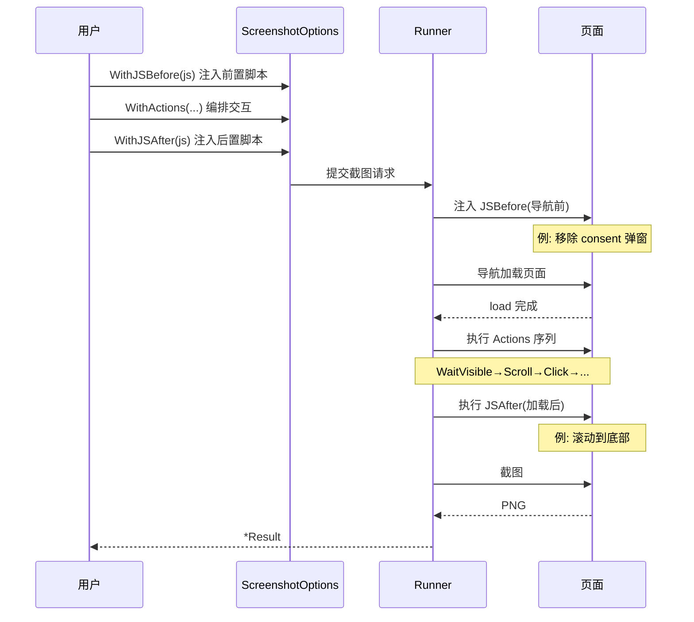

# JS 与交互构建器

<p align="center">☕ 注入 JS 与结构化交互动作。</p>

## JS 选项

| 选项 | 说明 |
|------|------|
| `WithJS(js)` | 页面加载后执行 |
| `WithJSBefore(js)` | 加载前执行 |
| `WithJSAfter(js)` | 加载后执行 |
| `WithJSFile(path, beforeLoad)` | 从文件加载 JS |

## 交互动作（Actions）

`WithActions(actions...)` 接收 `runner.InteractionAction`，工厂函数：

| 工厂 | 说明 |
|------|------|
| `ActionClick(selector)` | 点击 |
| `ActionClickXPath(xpath)` | 点击（XPath） |
| `ActionType(selector, value)` | 输入文本 |
| `ActionTypeXPath(xpath, value)` | 输入（XPath） |
| `ActionScroll(selector, pixels)` | 滚动 |
| `ActionWait(duration)` | 等待时长 |
| `ActionWaitVisible(selector)` | 等待元素可见 |
| `ActionWaitVisibleXPath(xpath)` | 等待可见（XPath） |
| `ActionHover(selector)` | 悬停 |
| `ActionHoverXPath(xpath)` | 悬停（XPath） |

## 示例

```go
// 注入 JS
opts := sdk.NewScreenshotOptions(
    sdk.WithJS("window.scrollTo(0, document.body.scrollHeight)"),
    sdk.WithJSBefore("document.querySelector('.consent')?.remove()"),
)

// 交互动作
opts := sdk.NewScreenshotOptions(
    sdk.WithActions(
        sdk.ActionWaitVisible("#content"),
        sdk.ActionScroll("body", 1000),
        sdk.ActionWait(2 * time.Second),
        sdk.ActionClick("#load-more"),
        sdk.ActionWaitVisible(".item-extra"),
    ),
)
```

## 执行顺序


## 与表单的区别

::: info 通用交互 vs 结构化表单
| 方式 | 适合 | 复杂度 |
|------|------|--------|
| `WithActions` | 通用交互（点击/输入/滚动/等待/悬停） | 自由组合，需自己编排顺序 |
| `WithForm` | 结构化表单填写+提交 | 框架托管提交逻辑，见 [表单构建](./builder-form) |

简单页面交互用 `WithActions`；要填表单登录用 `WithForm`。
:::

## JS 注入与交互时序

JSBefore/JSAfter 与 Actions 的执行顺序贯穿整个页面生命周期：



`WithJS` 是 `WithJSAfter` 的别名，加载后执行。

## 下一步

- [构建器总览](./builders)
- [表单构建](./builder-form)
- [JS 注入（进阶）](../advanced/js-injection)
- [表单与交互（进阶）](../advanced/forms)
