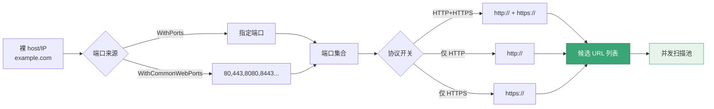

# 端口与协议构建器

<p align="center">🔌 SDK 控制目标协议与端口展开。</p>

## 选项

| 选项 | 说明 |
|------|------|
| `WithPorts(ports...)` | 指定端口 |
| `WithCommonWebPorts()` | 常见 Web 端口 |
| `WithTargetProtocols(http, https)` | 协议开关 |
| `WithHTTPOnly()` | 仅 HTTP |
| `WithHTTPPorts(ports...)` | 仅 HTTP + 端口 |
| `WithHTTPSOnly()` | 仅 HTTPS |
| `WithHTTPSPorts(ports...)` | 仅 HTTPS + 端口 |
| `WithHTTPAndHTTPS()` | HTTP + HTTPS |
| `WithHTTPAndHTTPSPorts(ports...)` | HTTP+HTTPS + 端口 |

## 示例

```go
// 常见端口
opts := sdk.NewScreenshotOptions(
    sdk.WithCommonWebPorts(),
    sdk.WithHTTPAndHTTPS(),
)

// 指定端口
opts := sdk.NewScreenshotOptions(
    sdk.WithPorts(80, 443, 8080, 8443),
    sdk.WithHTTPAndHTTPS(),
)

// 仅 HTTPS
opts := sdk.NewScreenshotOptions(
    sdk.WithHTTPSPorts(443, 8443),
)

// 仅 HTTP
opts := sdk.NewScreenshotOptions(
    sdk.WithHTTPPorts(80, 8080),
)
```

## 与 ExpandTargets 配合

这些选项影响 `ExpandTargets` 对裸 host/IP 的展开：

```go
opts := sdk.NewScreenshotOptions(
    sdk.WithPorts(8080),
    sdk.WithHTTPAndHTTPS(),
)
targets := sdk.ExpandTargets([]string{"example.com"}, opts)
// => http://example.com:8080, https://example.com:8080
```

`ExpandTargets` 的展开流程：先判断输入是否带协议/端口，再按端口与协议组合生成候选：



::: warning ⚠️ 不是端口扫描
`--ports` 是 Web 候选 URL 展开，不进行 TCP/UDP 连通性探测，仅生成 `scheme://host:port` 形式的目标交给浏览器访问。
:::

见 [目标展开](./targets)。

## 说明

`--ports` 是 Web 候选 URL 展开，不是端口扫描。见 [端口展开 CLI](../cli/scan-ports)。

## 下一步

- [构建器总览](./builders)
- [目标展开](./targets)
- [端口展开 CLI](../cli/scan-ports)
