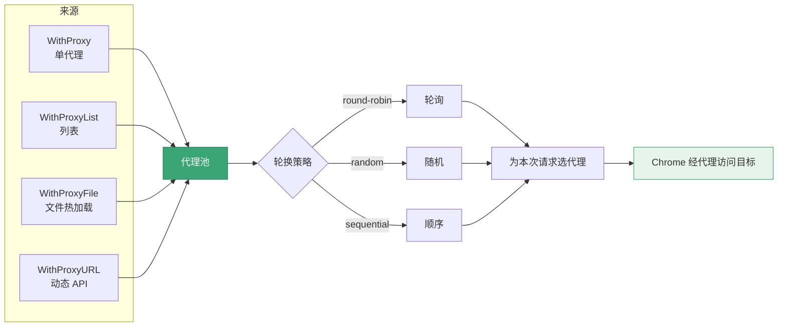

# 代理构建器

<p align="center">🔀 SDK 配置代理与轮换。</p>

## 选项

| 选项 | 说明 |
|------|------|
| `WithProxy(proxy)` | 单代理 |
| `WithProxyList(strategy, proxies...)` | 代理列表 |
| `WithProxyFile(path, strategy)` | 代理文件（热加载） |
| `WithProxyURL(url, strategy)` | 动态代理 API |
| `WithProxyStrategy(strategy)` | 轮换策略 |

策略类型 `runner.ProxyStrategy`：`round-robin`/`random`/`sequential`。

::: info sequential = 自动故障转移
代理不稳定时选 `ProxyStrategySequential`——当前代理失败**自动切下一个**，配合 `WithMaxRetries` 重试最大化成功率。`round-robin`/`random` 则不论成败轮换。
:::

## 示例

```go
// 单代理
opts := sdk.NewScreenshotOptions(
    sdk.WithProxy("http://127.0.0.1:8080"),
)

// 列表轮换
opts := sdk.NewScreenshotOptions(
    sdk.WithProxyList(runner.ProxyStrategyRoundRobin,
        "http://p1:8080", "http://p2:8080", "http://p3:8080",
    ),
)

// 文件
opts := sdk.NewScreenshotOptions(
    sdk.WithProxyFile("proxies.txt", runner.ProxyStrategyRandom),
)

// 动态 API
opts := sdk.NewScreenshotOptions(
    sdk.WithProxyURL("http://proxy-service/api", runner.ProxyStrategyRandom),
)
```

## 选择建议

| 场景 | 选 |
|------|-----|
| 单出口 | `WithProxy` |
| 少量固定 | `WithProxyList` |
| 大量、需更新 | `WithProxyFile` |
| 商业动态池 | `WithProxyURL` |

四种代理来源与轮换策略如何配合：



## 下一步

- [构建器总览](./builders)
- [代理与轮换（进阶）](../advanced/proxy)
- [内部 pkg/runner/proxy](../internals/runner-proxy)
