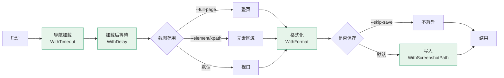

# 截图构建器

<p align="center">🖼️ 控制截图本身的 `With*` 选项。</p>

各选项作用于截图执行流程的不同阶段：



失败时 `WithMaxRetries` 控制重试次数。

## 选项

| 选项 | 说明 |
|------|------|
| `WithTimeout(d)` | 页面加载超时 |
| `WithDelay(d)` | 截图前等待 |
| `WithFullPage()` | 完整页面截图 |
| `WithElement(selector)` | CSS 选择器截图 |
| `WithXPath(xpath)` | XPath 截图 |
| `WithFormat(format, quality)` | 格式（png/jpeg）与质量 |
| `WithScreenshotPath(path)` | 截图保存目录 |
| `WithSkipSave()` | 跳过保存截图 |
| `WithMaxRetries(n)` | 最大重试次数 |

## 示例

```go
opts := sdk.NewScreenshotOptions(
    sdk.WithTimeout(60 * time.Second),
    sdk.WithDelay(2 * time.Second),
    sdk.WithFullPage(),
    sdk.WithFormat("jpeg", 80),
    sdk.WithScreenshotPath("./out"),
    sdk.WithMaxRetries(3),
)

// 元素截图
opts2 := sdk.NewScreenshotOptions(
    sdk.WithElement("#main-content"),
    sdk.WithFormat("png", 0),
)
```

## 超时与延迟

- `WithTimeout`：整体页面加载超时
- `WithDelay`：加载完成后额外等待，适合异步内容/动画

## 格式

`WithFormat("jpeg", 80)`：JPEG 质量 80。`WithFormat("png", 0)`：PNG（quality 忽略）。

## 跳过保存

`WithSkipSave()` 不落盘截图，常与字节模式或纯证据采集搭配。

## 下一步

- [构建器总览](./builders)
- [视口与设备](./builder-viewport)
- [截图选项 CLI](../cli/scan-screenshot)
