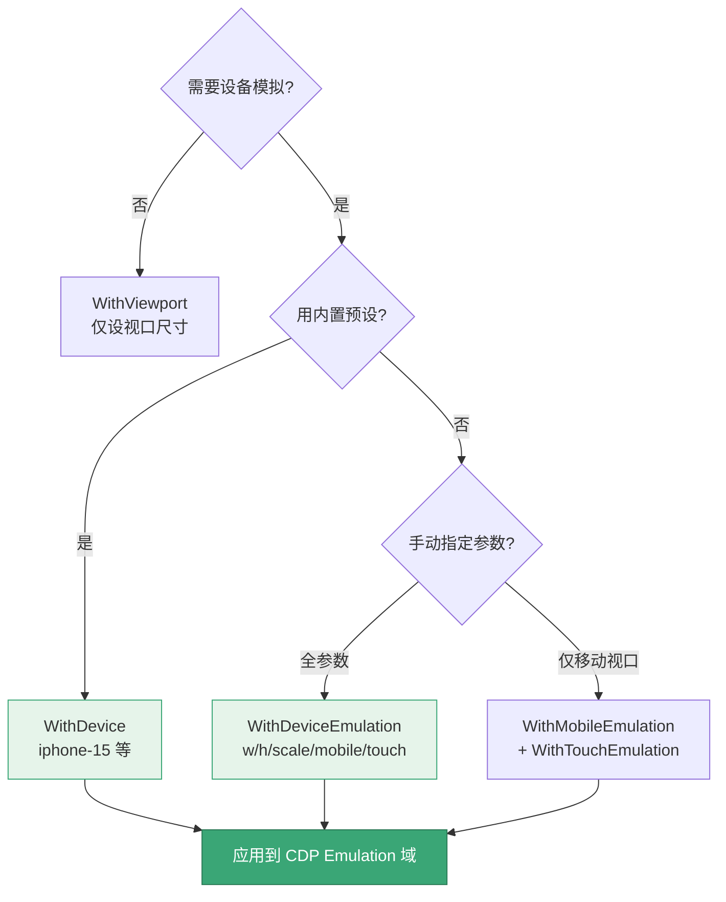
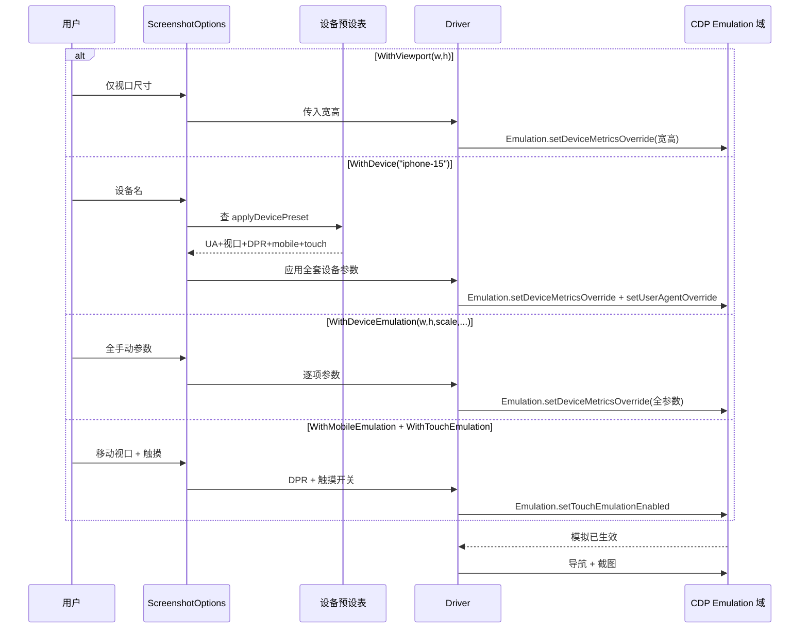

# 视口与设备构建器

<p align="center">📱 控制视口尺寸与设备模拟。</p>

## 选项

| 选项 | 说明 |
|------|------|
| `WithViewport(width, height)` | 视口尺寸 |
| `WithDevice(name)` | 设备预设（如 `iphone-15`） |
| `WithDeviceEmulation(w, h, scale, isMobile, hasTouch)` | 精细设备模拟 |
| `WithMobileEmulation(scaleFactor)` | 移动端视口 |
| `WithTouchEmulation(enabled)` | 触摸仿真 |

## 示例

```go
// 简单视口
opts := sdk.NewScreenshotOptions(
    sdk.WithViewport(1920, 1080),
)

// 设备预设
opts := sdk.NewScreenshotOptions(
    sdk.WithDevice("iphone-15"),
)

// 精细控制
opts := sdk.NewScreenshotOptions(
    sdk.WithDeviceEmulation(390, 844, 3.0, true, true),
)

// 移动端 + 触摸
opts := sdk.NewScreenshotOptions(
    sdk.WithMobileEmulation(3.0),
    sdk.WithTouchEmulation(true),
)
```

## WithDevice vs WithDeviceEmulation

设备模拟有三条路径，从简到繁：



::: tip 三条路径，从简到繁按需选
| 路径 | 选项 | 设了什么 | 适合 |
|------|------|---------|------|
| 仅视口 | `WithViewport(w,h)` | 只改尺寸 | 桌面端不同分辨率 |
| 内置预设 | `WithDevice("iphone-15")` | UA+视口+像素比+移动+触摸 | 模拟某真机 |
| 全手动 | `WithDeviceEmulation(...)` | 逐项指定 | 自定义设备/反检测 |

预设清单见 [设备模拟 CLI](../cli/scan-device) 与 `pkg/runner/device_presets.go`。
:::

## 视口与设备应用到 CDP 时序

三条路径最终都汇入 CDP 的 `Emulation` 域，时序如下：



四条路径差异在"设了什么"，但最终都通过 CDP `Emulation` 域落地。

## 下一步

- [构建器总览](./builders)
- [截图构建器](./builder-screenshot)
- [设备模拟（进阶）](../advanced/device)
