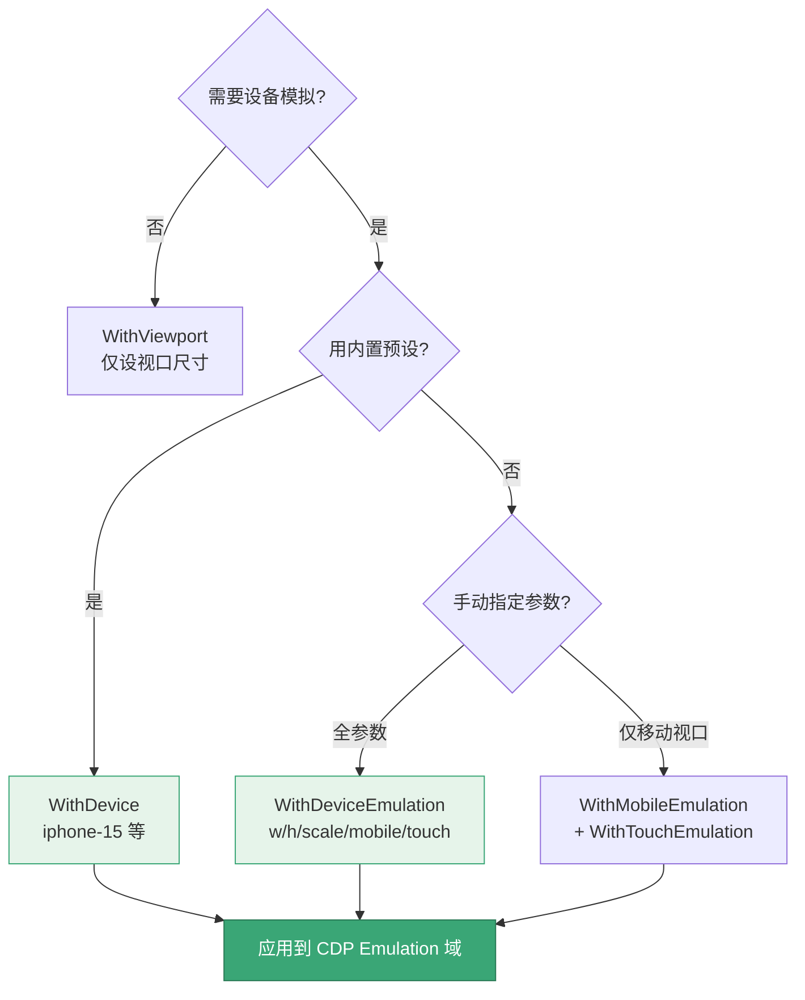

# 视口与设备构建器

<p align="center">📱 控制视口尺寸与设备模拟。</p>

## 选项

| 选项 | 说明 |
|------|------|
| `WithViewport(width, height)` | 视口尺寸 |
| `WithDevice(name)` | 设备预设（如 `iphone-15`） |
| `WithDeviceEmulation(w, h, scale, isMobile, hasTouch)` | 精细设备模拟 |
| `WithMobileEmulation(scaleFactor)` | 移动端视口 |
| `WithTouchEmulation(enabled)` | 触摸仿真 |

## 示例

```go
// 简单视口
opts := sdk.NewScreenshotOptions(
    sdk.WithViewport(1920, 1080),
)

// 设备预设
opts := sdk.NewScreenshotOptions(
    sdk.WithDevice("iphone-15"),
)

// 精细控制
opts := sdk.NewScreenshotOptions(
    sdk.WithDeviceEmulation(390, 844, 3.0, true, true),
)

// 移动端 + 触摸
opts := sdk.NewScreenshotOptions(
    sdk.WithMobileEmulation(3.0),
    sdk.WithTouchEmulation(true),
)
```

## WithDevice vs WithDeviceEmulation

设备模拟有三条路径，从简到繁：



- `WithDevice(name)`：用预设（含 UA/视口/像素比/移动/触摸）
- `WithDeviceEmulation(...)`：手动指定各参数

预设清单见 [设备模拟 CLI](../cli/scan-device) 与 `pkg/runner/device_presets.go`。

## 下一步

- [构建器总览](./builders)
- [截图构建器](./builder-screenshot)
- [设备模拟（进阶）](../advanced/device)
