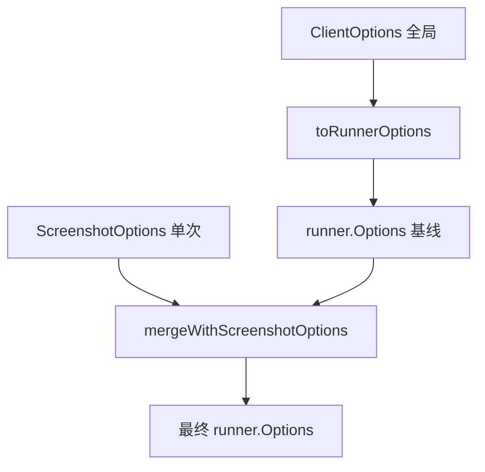
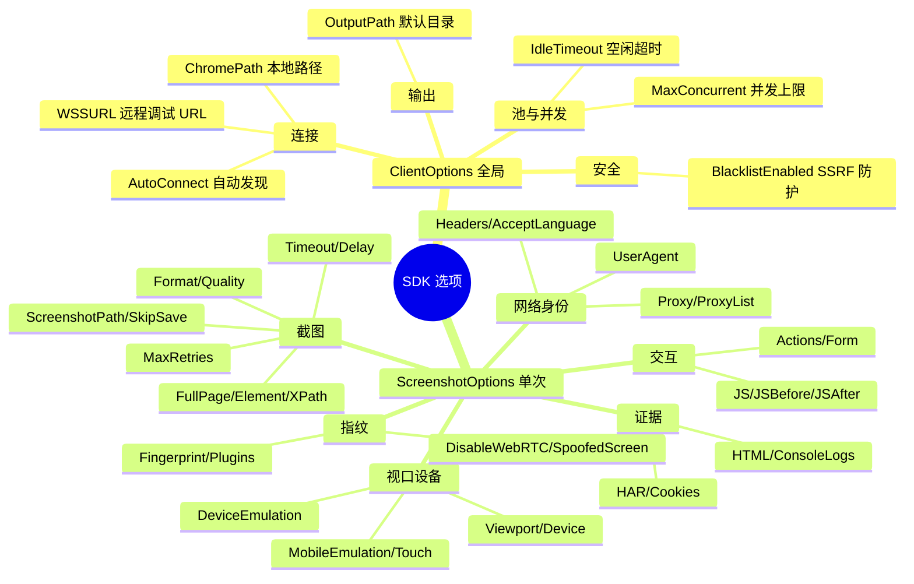

# ClientOptions

⚙️ `pkg/sdk/options.go` — Client 与截图选项。

> 📁 源码：[`pkg/sdk/options.go`](https://github.com/cyberspacesec/snir-skills/blob/main/pkg/sdk/options.go)

## 类型

| 符号 | 源码 | 说明 |
|------|------|------|
| `ClientOptions` | [L11](https://github.com/cyberspacesec/snir-skills/blob/main/pkg/sdk/options.go#L11) | Client 级配置 |
| `DefaultClientOptions()` | [L97](https://github.com/cyberspacesec/snir-skills/blob/main/pkg/sdk/options.go#L97) | 安全默认 |
| `ScreenshotOptions` | [L118](https://github.com/cyberspacesec/snir-skills/blob/main/pkg/sdk/options.go#L118) | 单次截图配置 |
| `toRunnerOptions(co)` | [L201](https://github.com/cyberspacesec/snir-skills/blob/main/pkg/sdk/options.go#L201) | 转 runner.Options |
| `mergeWithScreenshotOptions(base, so)` | [L326](https://github.com/cyberspacesec/snir-skills/blob/main/pkg/sdk/options.go#L326) | 合并截图选项 |
| `formHasConfig(form)` | [L557](https://github.com/cyberspacesec/snir-skills/blob/main/pkg/sdk/options.go#L557) | 表单是否有配置 |
| `applyDevicePreset(device, opts)` | [L564](https://github.com/cyberspacesec/snir-skills/blob/main/pkg/sdk/options.go#L564) | 应用设备预设 |

## ClientOptions 字段

| 字段 | 说明 |
|------|------|
| `MaxConcurrent` | 池大小/并发上限 |
| `ChromePath` | 本地 Chrome 路径 |
| `WSSURL` | 远程调试 URL |
| `IdleTimeout` | 空闲超时 |
| `BlacklistEnabled` | SSRF 防护开关 |
| `OutputPath` | 默认输出目录 |

## 两层配置

- `ClientOptions`：跨多次截图的稳定配置（Chrome、池大小）
- `ScreenshotOptions`：单次覆盖（视口、证据、代理）

## DefaultClientOptions

::: tip 没特殊需求就用默认
[`DefaultClientOptions`](https://github.com/cyberspacesec/snir-skills/blob/main/pkg/sdk/options.go#L97) 提供开箱即用的**安全默认**：
- ✅ 启用黑名单（SSRF 防护）
- ✅ 合理并发上限与超时
- ✅ 合理空闲超时

99% 的场景直接 `DefaultClientOptions()` 起步即可，按需覆盖个别字段，别从零构造。
:::

## 设备预设

[`applyDevicePreset`](https://github.com/cyberspacesec/snir-skills/blob/main/pkg/sdk/options.go#L564)：当指定 `device` 时，从 [`device_presets`](../internals/runner-device) 取视口/UA/DPR 应用到 Options。

## ClientOptions 配置维度

`ClientOptions` 与 `ScreenshotOptions` 的字段按职责归类：

`ClientOptions` 设跨多次截图的稳定基线，`ScreenshotOptions` 做单次覆盖，二者经 `mergeWithScreenshotOptions` 合并。

## 下一步

- [Client](./client)
- [构建器](./builders)
- [Options（内部）](../internals/runner-options)
- [设备模拟](../advanced/device)
