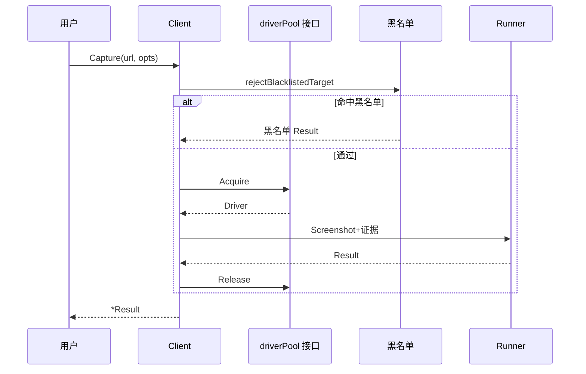
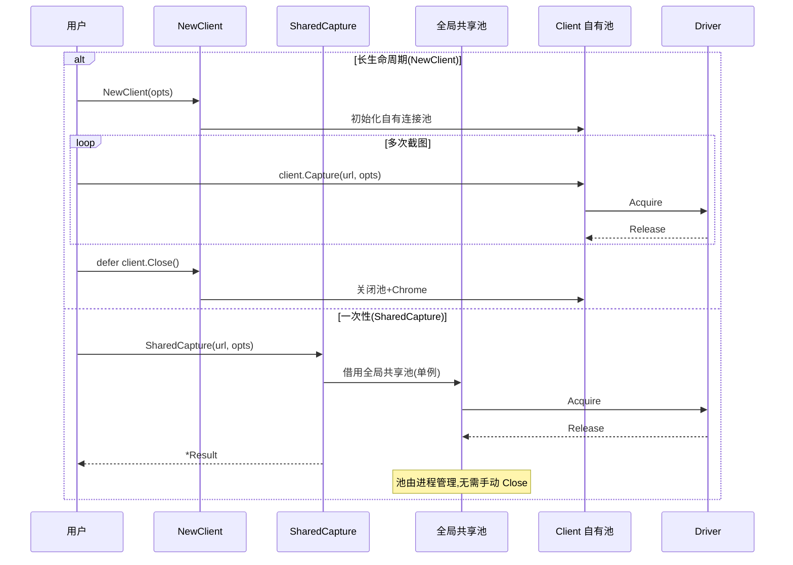

# Client 客户端

<p align="center">🔌 `pkg/sdk/client.go` — 长生命周期采集客户端。</p>

`Client` 持有连接池，复用 Chrome 实例，适合在程序生命周期内多次截图。

> 📁 源码：[`pkg/sdk/client.go`](https://github.com/cyberspacesec/snir-skills/blob/main/pkg/sdk/client.go)

## 构造

| 方法 | 源码 | 说明 |
|------|------|------|
| `NewClient(opts)` | [L78](https://github.com/cyberspacesec/snir-skills/blob/main/pkg/sdk/client.go#L78) | 标准构造 |
| `NewRemoteClient(wsURL, max)` | [L113](https://github.com/cyberspacesec/snir-skills/blob/main/pkg/sdk/client.go#L113) | 连远程 Chrome |

## 核心方法

| 方法 | 源码 | 说明 |
|------|------|------|
| `Capture(url, options...)` | [L147](https://github.com/cyberspacesec/snir-skills/blob/main/pkg/sdk/client.go#L147) | 链式截图 |
| `CaptureWithContext` | [L152](https://github.com/cyberspacesec/snir-skills/blob/main/pkg/sdk/client.go#L152) | 带 context |
| `Screenshot(url, opts)` | [L160](https://github.com/cyberspacesec/snir-skills/blob/main/pkg/sdk/client.go#L160) | 结构体截图 |
| `ScreenshotWithContext` | [L166](https://github.com/cyberspacesec/snir-skills/blob/main/pkg/sdk/client.go#L166) | 带 context |
| `ScreenshotBytes` | [L189](https://github.com/cyberspacesec/snir-skills/blob/main/pkg/sdk/client.go#L189) | 直接取 PNG 字节 |

## 证据方法

| 方法 | 源码 | 说明 |
|------|------|------|
| `ScreenshotHTML` | [L249](https://github.com/cyberspacesec/snir-skills/blob/main/pkg/sdk/client.go#L249) | HTML 源码 |
| `ScreenshotHeaders` | [L261](https://github.com/cyberspacesec/snir-skills/blob/main/pkg/sdk/client.go#L261) | 响应头 |
| `ScreenshotCookies` | [L280](https://github.com/cyberspacesec/snir-skills/blob/main/pkg/sdk/client.go#L280) | Cookies |
| `ScreenshotConsole` | [L299](https://github.com/cyberspacesec/snir-skills/blob/main/pkg/sdk/client.go#L299) | Console 日志 |
| `ScreenshotNetwork` | [L318](https://github.com/cyberspacesec/snir-skills/blob/main/pkg/sdk/client.go#L318) | 网络日志 |

## 便捷封装

| 方法 | 源码 | 说明 |
|------|------|------|
| `ScreenshotWithFormat` | [L337](https://github.com/cyberspacesec/snir-skills/blob/main/pkg/sdk/client.go#L337) | jpeg/webp 格式 |
| `ScreenshotToPath` | [L353](https://github.com/cyberspacesec/snir-skills/blob/main/pkg/sdk/client.go#L353) | 直接存盘 |
| `ScreenshotWithDelay` | [L360](https://github.com/cyberspacesec/snir-skills/blob/main/pkg/sdk/client.go#L360) | 额外等待 |
| `ScreenshotWithTimeout` | [L374](https://github.com/cyberspacesec/snir-skills/blob/main/pkg/sdk/client.go#L374) | 自定义超时 |
| `ScreenshotWithProxy` | [L388](https://github.com/cyberspacesec/snir-skills/blob/main/pkg/sdk/client.go#L388) | 单代理 |
| `ScreenshotWithProxyList` | [L402](https://github.com/cyberspacesec/snir-skills/blob/main/pkg/sdk/client.go#L402) | 代理列表轮换 |
| `ScreenshotWithProxyFile` | [L416](https://github.com/cyberspacesec/snir-skills/blob/main/pkg/sdk/client.go#L416) | 代理文件 |
| `ScreenshotWithCustomHeaders` | [L444](https://github.com/cyberspacesec/snir-skills/blob/main/pkg/sdk/client.go#L444) | 自定义请求头 |
| `ScreenshotWithUserAgent` | [L458](https://github.com/cyberspacesec/snir-skills/blob/main/pkg/sdk/client.go#L458) | 自定义 UA |
| `ScreenshotWithAcceptLanguage` | [L472](https://github.com/cyberspacesec/snir-skills/blob/main/pkg/sdk/client.go#L472) | 语言 |
| `ScreenshotWithFingerprint` | [L486](https://github.com/cyberspacesec/snir-skills/blob/main/pkg/sdk/client.go#L486) | 指纹注入 |

## 内部流程



## 生命周期

::: warning 别忘 `defer client.Close()`
`Client` 持有 Chrome 连接池，**不 Close 会泄漏浏览器进程**。正确模式：

```go
client, _ := sdk.NewClient(opts)
defer client.Close()   // ← 必须有
for _, url := range urls {
    res, _ := client.Capture(url, sdk.WithFullPage())
}
```

- ✅ 长生命周期服务：构造一次，循环复用，程序退出前 Close
- ✅ 短期一次性任务：用 `sdk.SharedCapture` 更省心，无需管理 Client
:::

## Client vs SharedCapture 复用路径

两条路径都复用 Driver 池，区别在池的归属与生命周期管理：



`SharedCapture` 走全局共享池单例（见 [共享池](./shared)），适合单次/少量调用；`NewClient` 自管池，适合循环复用。

## 下一步

- [ClientOptions](./client-options)
- [构建器](./builders)
- [结果与证据](./result)
- [共享池](./shared)
- [pkg/sdk（内部）](../internals/sdk)
