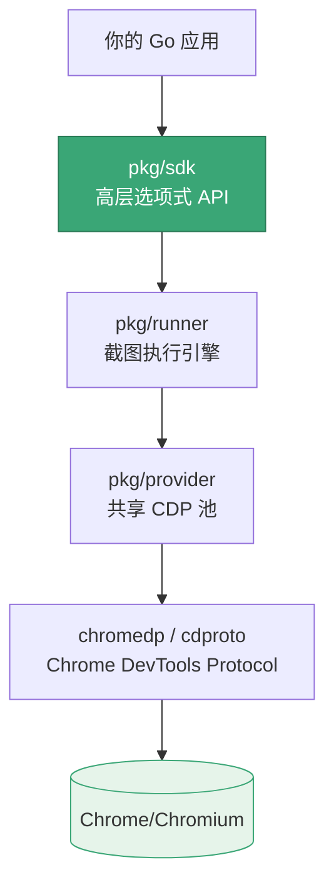
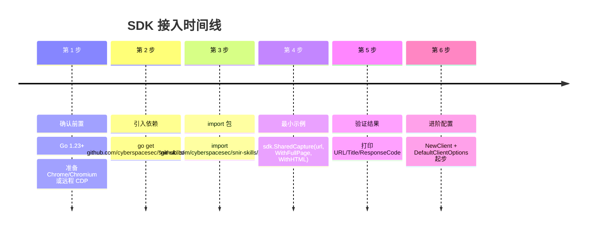

# SDK 安装与依赖

<p align="center">📦 在 Go 项目中引入 snir SDK。</p>

## 前置

- Go 1.23+
- Chrome/Chromium（或远程 CDP 端点）

SDK 在整个 snir 体系中的层级位置：



`pkg/sdk` 是最上层封装，绝大多数场景只需调用 `sdk.Shared*` 系列函数，底层 runner/provider/cdp 已自动串联。

## 引入

```bash
go get github.com/cyberspacesec/snir-skills/pkg/sdk
```

```go
import "github.com/cyberspacesec/snir-skills/pkg/sdk"
```

模块路径见 `go.mod`：

```
module github.com/cyberspacesec/snir-skills
go 1.23.0
```

## 最小可运行示例

::: details 完整可跑 main.go
```go
package main

import (
    "fmt"
    "github.com/cyberspacesec/snir-skills/pkg/sdk"
)

func main() {
    result, err := sdk.SharedCapture("https://example.com",
        sdk.WithFullPage(),
        sdk.WithHTML(),
    )
    if err != nil {
        panic(err)
    }
    fmt.Println(result.URL, result.Title, result.ResponseCode)
}
```
`SharedCapture` 用共享池，无需手动管理 Client 生命周期——单次/少量调用最省事。
:::

## 依赖

SDK 间接依赖 chromedp/cdproto（CDP）、gorm（若用 DB）等，由 `go.mod` 管理，`go get` 自动拉取。

## 本地开发

若同仓库内开发：

```bash
git clone https://github.com/cyberspacesec/snir-skills.git
cd snir-skills
go build ./...
go test ./pkg/sdk/...
```

## 安装时间线

从零到跑通第一个截图，按时间顺序的步骤：



`SharedCapture` 用共享池，无需管理 Client 生命周期——单次/少量调用最省事。

## 下一步

- [SDK 总览](./overview)
- [Client 客户端](./client)
- [选项构建器](./builders)
