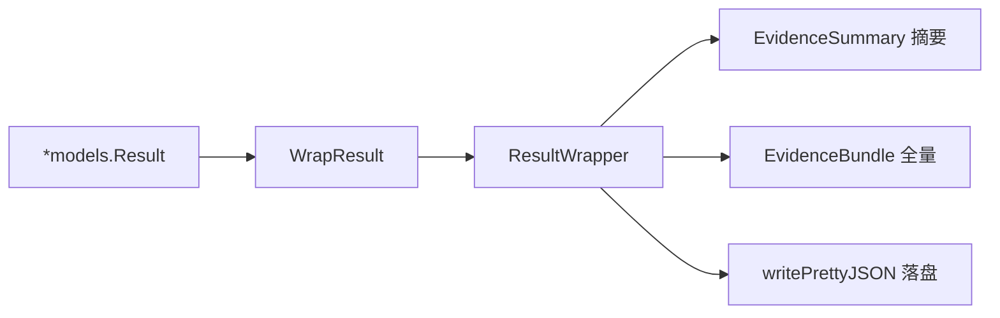
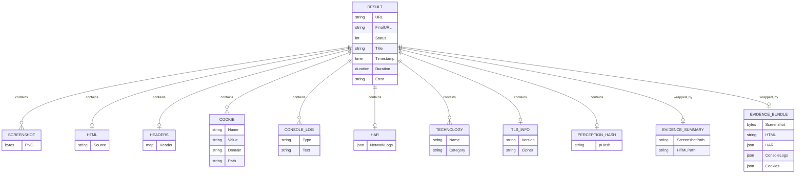

# 结果与证据

<p align="center">📦 `pkg/sdk/result.go` — 结果包装与便捷提取。</p>

> 📁 源码：[`pkg/sdk/result.go`](https://github.com/cyberspacesec/snir-skills/blob/main/pkg/sdk/result.go)

## 类型

| 符号 | 源码 | 说明 |
|------|------|------|
| `EvidenceSummary` | [L15](https://github.com/cyberspacesec/snir-skills/blob/main/pkg/sdk/result.go#L15) | 证据摘要 |
| `EvidenceBundle` | [L30](https://github.com/cyberspacesec/snir-skills/blob/main/pkg/sdk/result.go#L30) | 完整证据包 |
| `ResultWrapper` | [L41](https://github.com/cyberspacesec/snir-skills/blob/main/pkg/sdk/result.go#L41) | Result 包装器 |
| `WrapResult(r)` | [L46](https://github.com/cyberspacesec/snir-skills/blob/main/pkg/sdk/result.go#L46) | 包装 |
| `hasTLSInfo(tls)` | [L352](https://github.com/cyberspacesec/snir-skills/blob/main/pkg/sdk/result.go#L352) | 是否有 TLS 信息 |
| `writePrettyJSON(path, value)` | [L378](https://github.com/cyberspacesec/snir-skills/blob/main/pkg/sdk/result.go#L378) | 美化写 JSON |

## Result 字段（核心）

`*models.Result` 是一切采集的顶层结构，字段见 [Result Schema](../reference/result-schema) 与 [pkg/models](../internals/models)。

```
Result
├── URL / FinalURL / Status / Title
├── Screenshot []byte (PNG)
├── HTML / Headers / Cookies / ConsoleLogs
├── NetworkLogs (HAR)
├── Technologies []Technology
├── PerceptionHash (pHash)
├── TLS 信息
├── Timestamp / Duration
└── Error (若有)
```

## 字节提取

`screenshotBytesFromResult`（[client.go#L231](https://github.com/cyberspacesec/snir-skills/blob/main/pkg/sdk/client.go#L231)）从 Result 安全取出截图字节，供 `*Bytes` 系列方法使用。

## EvidenceBundle

::: tip 批量场景的"证据打包袋"
`EvidenceBundle` 把截图+HTML+HAR+Console+Cookies **一次打包**，批量场景常用——不用逐个字段取，一个结构拿全证据，配合 `writePrettyJSON` 直接落盘成可读 JSON 存档。
:::

## 包装流程



## Result 与证据字段关系

`*models.Result` 是顶层结构，各类证据以字段形式挂载其下，关系如下：



`EvidenceSummary` 取关键字段做摘要，`EvidenceBundle` 把截图+HTML+HAR+Console+Cookies 一次打包，便于批量存档。

## 下一步

- [Result Schema](../reference/result-schema)
- [字段说明](../reference/fields)
- [pkg/models](../internals/models)
- [Client](./client)
