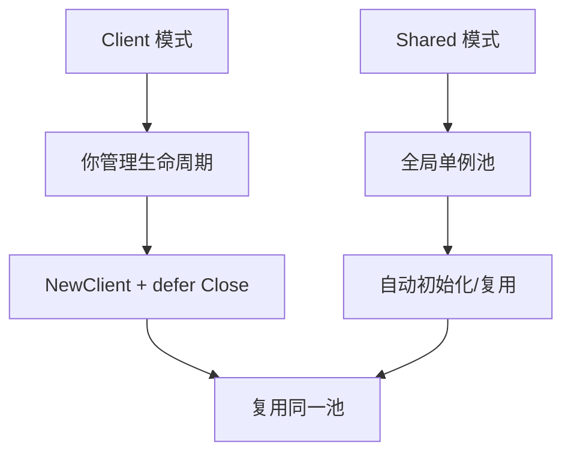
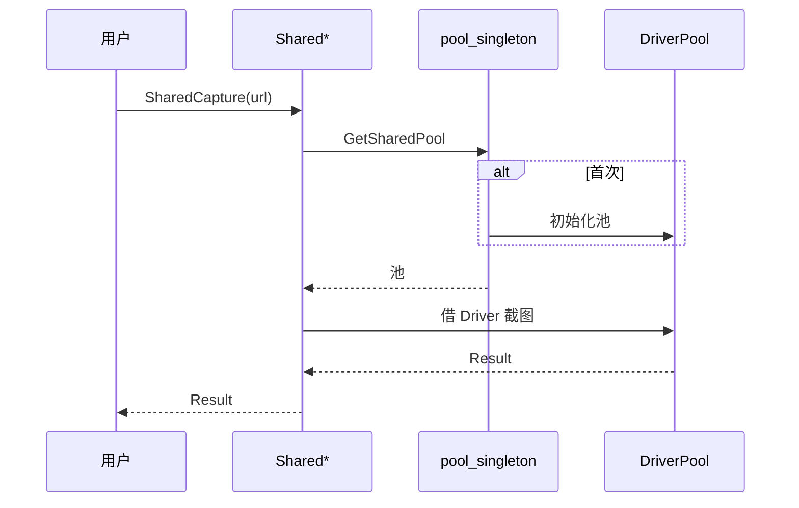

# 共享池

♻️ `pkg/sdk/shared.go` — 无需管理 Client 的便捷函数。

`Shared*` 函数底层用进程内全局共享池（[`pool_singleton`](../internals/runner-pool-singleton)），适合脚本/CLI 风格的零散调用，自动复用 Chrome。

> 📁 源码：[`pkg/sdk/shared.go`](https://github.com/cyberspacesec/snir-skills/blob/main/pkg/sdk/shared.go)

## 函数

| 符号 | 源码 | 说明 |
|------|------|------|
| `SharedScreenshot(url, opts)` | [L24](https://github.com/cyberspacesec/snir-skills/blob/main/pkg/sdk/shared.go#L24) | 截图 |
| `SharedCapture(url, options...)` | [L29](https://github.com/cyberspacesec/snir-skills/blob/main/pkg/sdk/shared.go#L29) | 链式 |
| `SharedCaptureWithContext` | [L34](https://github.com/cyberspacesec/snir-skills/blob/main/pkg/sdk/shared.go#L34) | 带 ctx |
| `SharedScreenshotWithContext` | [L39](https://github.com/cyberspacesec/snir-skills/blob/main/pkg/sdk/shared.go#L39) | 带 ctx |
| `SharedScreenshotBytes` | [L62](https://github.com/cyberspacesec/snir-skills/blob/main/pkg/sdk/shared.go#L62) | 取字节 |
| `SharedScreenshotHTML` | [L105](https://github.com/cyberspacesec/snir-skills/blob/main/pkg/sdk/shared.go#L105) | 取 HTML |
| `SharedScreenshotHeaders` | [L117](https://github.com/cyberspacesec/snir-skills/blob/main/pkg/sdk/shared.go#L117) | 取响应头 |
| `SharedScreenshotCookies` | [L136](https://github.com/cyberspacesec/snir-skills/blob/main/pkg/sdk/shared.go#L136) | 取 Cookies |
| `SharedScreenshotConsole` | [L155](https://github.com/cyberspacesec/snir-skills/blob/main/pkg/sdk/shared.go#L155) | 取 Console |
| `SharedScreenshotNetwork` | [L174](https://github.com/cyberspacesec/snir-skills/blob/main/pkg/sdk/shared.go#L174) | 取网络日志 |
| `SharedScreenshotWithFormat` | [L193](https://github.com/cyberspacesec/snir-skills/blob/main/pkg/sdk/shared.go#L193) | 自定义格式 |
| `SharedScreenshotToPath` | [L209](https://github.com/cyberspacesec/snir-skills/blob/main/pkg/sdk/shared.go#L209) | 直接存盘 |

## 与 Client 的区别

- `Client`：显式构造、显式关闭，控制力强
- `Shared*`：零管理，首次调用自动建池，进程退出时释放

## 内部流转

## 何时用

- 一次性脚本
- 演示/示例
- 不想管 Client 生命周期

需要细粒度控制（自定义池大小、远程 Chrome、关闭时机）用 [Client](./client)。

## 下一步

- [Client](./client)
- [共享池单例（内部）](../internals/runner-pool-singleton)
- [自动连接](./autoconnect)
- [并发与池](../advanced/concurrency)
